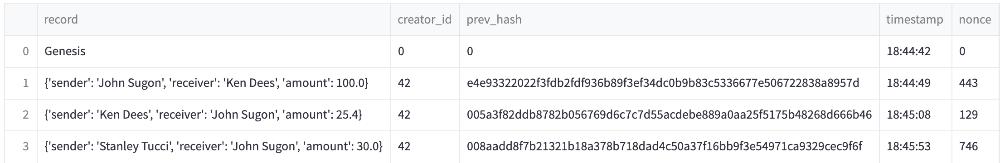
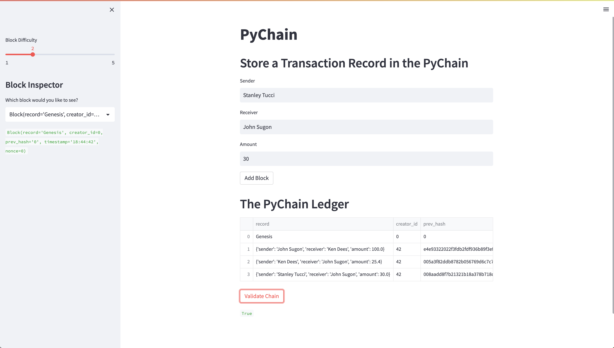

# challenge-18
Columbia FinTech Bootcamp Challenge 18

## Technologies
For this project, I used Python 3 with the following packages

* streamlit
* dataclasses (dataclass)
* typing (Any, List)
* datetime
* pandas
* hashlib

## Assignment
For this project, we built a PoW (Proof-of-Work) blockchain from scratch with a simple web interace (using Streamlit) to log transactions. 

In order to implement this, we built three custom classes

1. Record: Records individual transactions. Keeps track of sender, receiver, and the transaction amount
2. Block: Keeps track of records (one per block) along with creator ID, the hash of the previous block, a timestamp for the time the block is mined, and a nonce (initialized to zero until the block is mined). 
	* We define `hash_block()` for Block which uses SHA256 to output the hash for the block, including its associated record, creator id, timestamp, previous block hash, and nonce.
3. PyChain: Blockchain which keeps track of blocks through a list called `chain`, as well as the mining difficulty for the chain (ie. number of leading zeroes).
	* We define `proof_of_work`, a function which computes the nonce for the block by iterating through possible values.
	* We define `add_block`, a function which adds a candidate block to the chain by running it through `proof_of_work`. 
	* We define `is_valid`, a function which confirms that the previous block hash of each block in the chain matches the actual result of running the hash function on that block.
	
Finally, we added Streamlit functionality to allow users to input transactions and add blocks to the chain. A sidebar contains a slider and blockchain inspector to analyze transactions and adjust proof-of-work difficulty.

See screenshots below for an example blockchain and the Streamlit front-end. 

